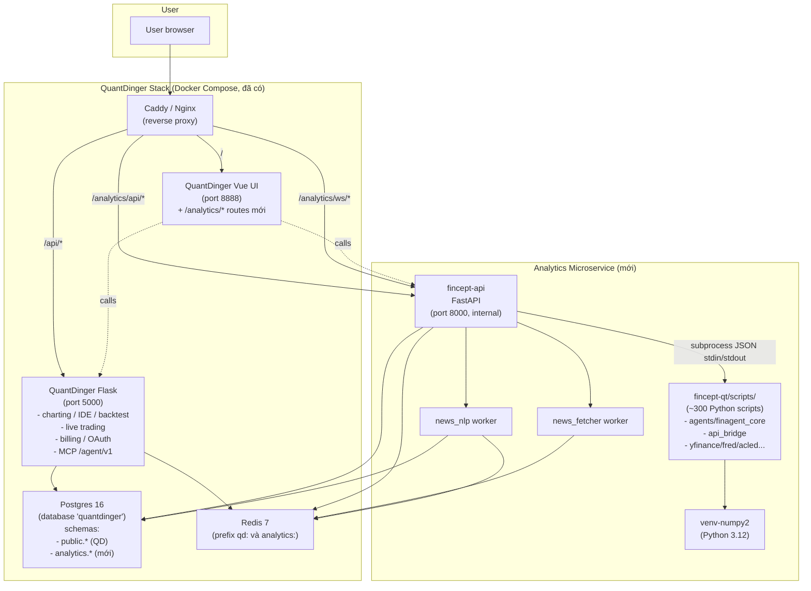
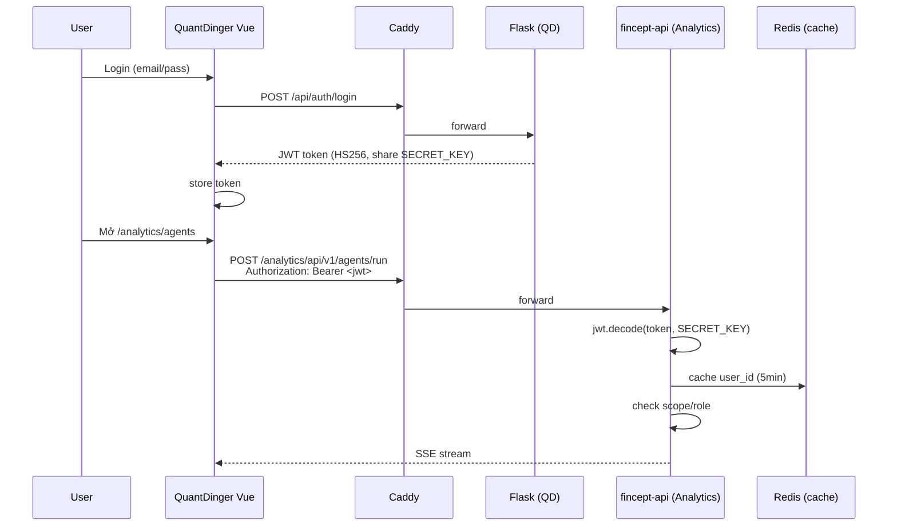

# Design — Analytics Microservice (Giai đoạn 1: tích hợp `fincept-api` vào QuantDinger)

> **Spec:** `analytics-microservice`
> **Phiên bản:** 1.0 — 20/05/2026
> **Tên hiển thị trong QuantDinger UI:** **Analytics**
> **Phương án:** A — dùng `fincept-api` hiện có làm microservice cạnh QuantDinger Flask. Sau khi có user thật và validation thị trường thì cân nhắc viết lại sạch (Phase 2 — out of scope spec này).

---

## Overview

Tận dụng `fincept-api` (FastAPI đã code xong, 146 tests pass) như một **microservice riêng** ghép vào hệ sinh thái QuantDinger. Module được gắn nhãn **"Analytics"** trong UI QuantDinger-Vue, cung cấp **4 capability**:

1. **News** — pipeline tin tức tự host (RSS + sentiment + WebSocket realtime)
2. **Chatbot** — chat OpenAI-compatible với streaming SSE và session persist
3. **Agent** — 37+ AI personas (Buffett, Lynch, Munger…), multi-agent team, execution planner
4. **Analytics** — DCF, technicals, portfolio optimization, forecast, comprehensive stock analysis

**Phương án A** chọn giai đoạn này vì:
- Effort thấp nhất (4–5 tuần) để có demo trên QuantDinger UI
- Tận dụng 100% công sức đã bỏ vào `fincept-api`
- Reversible: nếu sau này cần viết lại sạch về pháp lý, có thể migrate dần

**Cảnh báo pháp lý đã ghi nhận:** `fincept-api` + scripts ràng buộc AGPL-3.0 + Commercial của Fincept Corp. Giai đoạn 1 chỉ self-host nội bộ / staging, **chưa commercial deploy**. Bước commercial sẽ làm sau khi có user và đã hoàn thành rewrite (Phase 2).

---

## Architecture

### High-level topology



### Auth flow chia sẻ



### Database namespace

```
postgres database "quantdinger" (đã có)
├── public.*           ← QuantDinger tables (giữ nguyên, không đụng)
└── analytics.*        ← Schema mới của microservice
    ├── analytics.news_articles
    ├── analytics.news_sources
    ├── analytics.chat_sessions
    ├── analytics.chat_messages
    ├── analytics.agent_runs
    └── analytics.audit_log
```

### Redis key namespace

```
qd:*                   ← QuantDinger Flask (giữ nguyên)
analytics:cache:*      ← fincept-api cache layer
analytics:rate:*       ← fincept-api rate limiter
analytics:news:queue   ← Redis Stream cho news pipeline
analytics:news:pubsub:* ← WebSocket fanout
analytics:job:*        ← Async job state (Phase later)
```

---

## Components and Interfaces

### Endpoint mapping (giai đoạn 1)

Chỉ giữ 4 module bạn yêu cầu (Analytics + Chatbot + Agent + News). Các module khác của fincept-api (QuantLib, Intelligence, Quant Lab) tạm tắt registration để giảm bề mặt tấn công và độ phức tạp.

| Path (qua Caddy) | Forward đến | Phase |
|---|---|---|
| `POST /analytics/api/v1/chat/completions` | fincept-api `/api/v1/chat/completions` (mới) | 2 |
| `GET  /analytics/api/v1/chat/sessions` | fincept-api `/api/v1/chat/sessions` (mới) | 2 |
| `POST /analytics/api/v1/agents/run/stream` | fincept-api `/api/v1/agents/run/stream` (đã có) | 3 |
| `GET  /analytics/api/v1/agents/` | fincept-api (đã có) | 3 |
| `POST /analytics/api/v1/agents/team/run` | fincept-api (đã có) | 3 |
| `POST /analytics/api/v1/agents/plan/{kind}` | fincept-api (đã có) | 3 |
| `POST /analytics/api/v1/agents/analyze/{kind}` | fincept-api (đã có) | 3 |
| `GET  /analytics/api/v1/news` | fincept-api `/api/v1/news` (mới) | 1 |
| `GET  /analytics/api/v1/news/search` | fincept-api (mới) | 1 |
| `GET  /analytics/api/v1/news/{id}` | fincept-api (mới) | 1 |
| `WS   /analytics/ws/news` | fincept-api WebSocket (mới) | 1 |
| `GET  /analytics/api/v1/market/quote/{symbol}` | fincept-api (đã có) | 4 |
| `GET  /analytics/api/v1/equity/{symbol}/info` | fincept-api (đã có) | 4 |
| `POST /analytics/api/v1/equity/{symbol}/dcf` | fincept-api (đã có) | 4 |
| `POST /analytics/api/v1/technical/indicators` | fincept-api (đã có) | 4 |
| `POST /analytics/api/v1/portfolio/optimize` | fincept-api (đã có) | 4 |
| `GET  /analytics/api/v1/health` | fincept-api `/health` | 0 |

### Auth bridge

`fincept-api` hiện đang dùng API key + JWT độc lập. Cần thêm middleware mới verify JWT do QuantDinger Flask phát hành:

```python
# fincept-api/core/auth.py — thêm function mới
from jose import jwt, JWTError
from fastapi import HTTPException, Request
from app.config import settings

async def verify_quantdinger_jwt(request: Request) -> dict:
    """Verify JWT issued by QuantDinger Flask backend.

    Reads SECRET_KEY from env (must match Flask SECRET_KEY).
    Returns claims dict with user_id, email, role.
    """
    auth = request.headers.get("Authorization", "")
    if not auth.startswith("Bearer "):
        raise HTTPException(401, "Missing bearer token")
    token = auth[7:]
    try:
        claims = jwt.decode(
            token,
            settings.QUANTDINGER_JWT_SECRET,
            algorithms=[settings.QUANTDINGER_JWT_ALGORITHM],
        )
    except JWTError as e:
        raise HTTPException(401, f"Invalid token: {e}")
    return claims
```

QuantDinger Flask (Apache 2.0) cần publish ra schema JWT để biết key payload (sub/email/exp/role). Đọc từ source code QuantDinger backend để confirm — khi triển khai sẽ verify thực tế.

### News module (mới — Phase 1)

```
fincept-api/
├── app/routers/news.py              ← Endpoints REST + WebSocket
└── workers/
    ├── news_fetcher.py              ← RSS fetcher (feedparser)
    └── news_nlp.py                  ← Sentiment + entity (FinBERT + spaCy)
```

Pipeline:

```
RSS sources ──► news_fetcher (mỗi 30s) ──► Redis Stream "analytics:news:queue"
                                                          │
                                          news_nlp consumer group
                                                          │
                                       dedupe + sentiment + entity + tickers
                                                          │
                          ┌───────────────────────────────┤
                          ▼                               ▼
                   Postgres analytics.news_articles    Redis publish "analytics:news:pubsub:{ticker}"
                                                          │
                                                          ▼
                                                  WebSocket fanout
                                                          │
                                                          ▼
                                                    Vue clients
```

### Chat module (mới — Phase 2)

```
fincept-api/
└── app/routers/chat.py
```

Endpoints:
- `POST /chat/completions` — OpenAI-compatible (proxy LLM provider qua LiteLLM hoặc httpx trực tiếp)
- `POST /chat/sessions` — tạo session, lưu Postgres
- `GET /chat/sessions` — list sessions của user
- `GET /chat/sessions/{id}` — chi tiết + messages
- `DELETE /chat/sessions/{id}`

Streaming SSE: dùng `fastapi.responses.StreamingResponse` (đã có pattern trong `agents/run/stream`).

### Agent module (đã có — chỉ wire UI)

`fincept-api/app/routers/agents.py` đã có 20+ endpoints. Phase 3 chỉ build UI.

### Analytics module (đã có phần lớn)

`fincept-api/app/routers/analytics.py` đã có 25+ endpoints (market, equity, portfolio, derivatives, technicals). Phase 4 chỉ build UI + thêm 1 endpoint comprehensive analysis (gộp 4-5 endpoint thành 1).

---

## Data Models

### Schema `analytics.*` cần tạo Phase 0

```sql
-- migrations/001_init_analytics_schema.sql
CREATE SCHEMA IF NOT EXISTS analytics;

-- News
CREATE TABLE analytics.news_sources (
    id          UUID PRIMARY KEY DEFAULT gen_random_uuid(),
    name        TEXT NOT NULL,
    url         TEXT NOT NULL,
    type        TEXT NOT NULL CHECK (type IN ('rss', 'scraper')),
    language    TEXT DEFAULT 'en',
    enabled     BOOLEAN DEFAULT true,
    last_fetched_at TIMESTAMPTZ,
    error_count INT DEFAULT 0,
    created_at  TIMESTAMPTZ DEFAULT now()
);

CREATE TABLE analytics.news_articles (
    id              UUID PRIMARY KEY DEFAULT gen_random_uuid(),
    source_id       UUID REFERENCES analytics.news_sources(id) ON DELETE SET NULL,
    source_name     TEXT NOT NULL,
    url             TEXT UNIQUE NOT NULL,
    url_hash        TEXT GENERATED ALWAYS AS (md5(url)) STORED,
    title           TEXT NOT NULL,
    summary         TEXT,
    body            TEXT,
    author          TEXT,
    published_at    TIMESTAMPTZ NOT NULL,
    fetched_at      TIMESTAMPTZ DEFAULT now(),
    language        TEXT,
    tickers         TEXT[],
    entities        JSONB DEFAULT '[]'::jsonb,
    sentiment       NUMERIC(4,3),
    importance      NUMERIC(3,2),
    raw             JSONB
);
CREATE INDEX idx_news_published ON analytics.news_articles(published_at DESC);
CREATE INDEX idx_news_tickers ON analytics.news_articles USING gin(tickers);
CREATE INDEX idx_news_fts ON analytics.news_articles
    USING gin(to_tsvector('simple', title || ' ' || coalesce(summary, '')));

-- Chat
CREATE TABLE analytics.chat_sessions (
    id          UUID PRIMARY KEY DEFAULT gen_random_uuid(),
    user_id     UUID NOT NULL,
    title       TEXT,
    persona_id  TEXT,
    model       TEXT,
    base_url    TEXT,
    metadata    JSONB DEFAULT '{}'::jsonb,
    created_at  TIMESTAMPTZ DEFAULT now()
);
CREATE INDEX idx_chat_sessions_user ON analytics.chat_sessions(user_id, created_at DESC);

CREATE TABLE analytics.chat_messages (
    id          UUID PRIMARY KEY DEFAULT gen_random_uuid(),
    session_id  UUID NOT NULL REFERENCES analytics.chat_sessions(id) ON DELETE CASCADE,
    role        TEXT NOT NULL CHECK (role IN ('system', 'user', 'assistant', 'tool')),
    content     TEXT NOT NULL,
    tool_calls  JSONB,
    tokens_in   INT,
    tokens_out  INT,
    latency_ms  INT,
    created_at  TIMESTAMPTZ DEFAULT now()
);
CREATE INDEX idx_chat_messages_session ON analytics.chat_messages(session_id, created_at);

-- Agent runs
CREATE TABLE analytics.agent_runs (
    id              UUID PRIMARY KEY DEFAULT gen_random_uuid(),
    user_id         UUID NOT NULL,
    persona_id      TEXT NOT NULL,
    query           TEXT,
    response        TEXT,
    duration_ms     INT,
    tokens_in       INT,
    tokens_out      INT,
    status          TEXT CHECK (status IN ('ok', 'error', 'cancelled')),
    error           JSONB,
    created_at      TIMESTAMPTZ DEFAULT now()
);
CREATE INDEX idx_agent_runs_user ON analytics.agent_runs(user_id, created_at DESC);

-- Audit log
CREATE TABLE analytics.audit_log (
    id          BIGSERIAL PRIMARY KEY,
    ts          TIMESTAMPTZ NOT NULL DEFAULT now(),
    user_id     UUID,
    action      TEXT NOT NULL,
    resource    TEXT,
    request_id  UUID,
    ip          INET,
    metadata    JSONB
);
CREATE INDEX idx_audit_ts ON analytics.audit_log(ts);
CREATE INDEX idx_audit_user_ts ON analytics.audit_log(user_id, ts);
```

---

## Correctness Properties

### Property 1: JWT validation

**Validates: Requirements 0.3**

Với JWT bất kỳ không hợp lệ (sai signature, expired, missing fields) → `/analytics/api/v1/*` (trừ `/health`) trả 401, không leak resource.

### Property 2: User isolation

**Validates: Requirements 0.4**

User A không truy cập được chat sessions của user B (resource thuộc user khác → 404, không 403).

### Property 3: Schema isolation

**Validates: Requirements 0.5**

Mọi query của fincept-api chỉ được đọc/ghi schema `analytics.*`, không touch `public.*` của QuantDinger. Verified bằng Postgres role với `GRANT USAGE ON SCHEMA analytics`.

### Property 4: News dedupe

**Validates: Requirements 1.2**

Với cùng URL (canonicalized: lowercase host, normalize trailing slash, strip fragment, sort query params) → chỉ có 1 row trong `analytics.news_articles`.

### Property 5: News ordering

**Validates: Requirements 1.2**

`GET /news?ticker=X&limit=N` luôn trả N article mới nhất theo `published_at DESC`.

### Property 6: News sentiment range

**Validates: Requirements 1.3**

Với mọi article có sentiment thì `-1 ≤ sentiment ≤ 1`.

### Property 7: Chat session ownership

**Validates: Requirements 2.2**

User chỉ access được session do mình tạo (`user_id == jwt.sub`).

### Property 8: Chat token accounting

**Validates: Requirements 2.3**

`tokens_in + tokens_out >= 0`; tổng cộng dồn theo session khớp với tổng từng message trong session.

### Property 9: Agent run audit

**Validates: Requirements 3.4**

Mọi agent run thành công có entry trong `analytics.agent_runs` với `user_id` khớp JWT claim.

### Property 10: Redis key namespace

**Validates: Requirements 0.6**

Mọi key fincept-api set vào Redis đều prefix `analytics:`, không collision với QuantDinger keys.

---

## Error Handling

Kế thừa error code enum từ `fincept-api/core/errors.py`. Bổ sung 1 code mới:

| Code | HTTP | Mô tả |
|---|---|---|
| `AUTH_REQUIRED` | 401 | JWT thiếu hoặc invalid |
| `FORBIDDEN` | 403 | JWT hợp lệ nhưng thiếu role/scope |
| `RATE_LIMITED` | 429 | Vượt rate limit (có Retry-After) |
| `INVALID_PARAMS` | 422 | Pydantic validation fail |
| `RESOURCE_NOT_FOUND` | 404 | Resource không tồn tại / không thuộc user |
| `SCRIPT_TIMEOUT` | 504 | Subprocess timeout |
| `SCRIPT_ERROR` | 502 | Subprocess error |
| `EXTERNAL_API_ERROR` | 502 | Upstream provider lỗi |
| `MISSING_API_KEY` | 400 | Thiếu API key upstream |
| `LLM_PROVIDER_ERROR` | 502 | LLM provider lỗi |
| `JOB_NOT_FOUND` | 404 | Job ID không tồn tại |
| `INTERNAL_ERROR` | 500 | Lỗi không phân loại |
| **`QUANTDINGER_DOWN`** (mới) | 503 | Gọi QuantDinger để verify user fail |

Response format:

```json
{
  "error": {
    "code": "AUTH_REQUIRED",
    "message": "Token expired",
    "details": {},
    "request_id": "550e8400-e29b-41d4-a716-446655440000"
  }
}
```

---

## Testing Strategy

### Unit tests (≥70% coverage cho code mới)

- `tests/test_auth_jwt.py` — verify JWT bridge với QuantDinger
- `tests/test_news_dedupe.py` — URL canonicalization PBT
- `tests/test_chat_completions.py` — mock LiteLLM
- `tests/test_news_fetcher.py` — mock feedparser

### Integration tests

- `tests/integration/test_two_backend.py` — Flask + FastAPI cùng Postgres + Redis, login Flask → token → gọi fincept-api
- `tests/integration/test_news_pipeline.py` — fixture RSS feed → fetcher → NLP → DB → WS

### Load tests (k6)

- `tests/load/k6_news_ws.js` — 200 concurrent WebSocket subscribers
- `tests/load/k6_chat_streaming.js` — 50 concurrent SSE streams

### E2E (Playwright, optional Phase 5)

- Login QD → mở `/analytics/news` → thấy ≥10 articles
- Mở `/analytics/chat` → gửi message → nhận streaming response
- Mở `/analytics/agents/warren_buffett` → run → thấy thinking + tokens

---

## Migration Plan

Migration từ trạng thái hiện tại sang target:

| Step | Hành động | File ảnh hưởng |
|---|---|---|
| 1 | Tạo branch `feature/analytics-microservice` trong workspace | — |
| 2 | Copy `fincept-api/` → `analytics/` (tên mới) | thư mục |
| 3 | Cập nhật `analytics/app/main.py` chỉ register 4 router cần thiết | main.py |
| 4 | Bỏ default LLM provider "fincept" trong config | `config.py`, `.env.example` |
| 5 | Sửa scripts liên quan `api.fincept.in` (3 file) | `agents/deepagents/orchestrator.py`, `agents/finagent_core/registries/{fincept_model,models_registry}.py` |
| 6 | Thêm middleware `verify_quantdinger_jwt` | `core/auth.py` |
| 7 | Đổi Redis prefix `fincept:` → `analytics:` | `core/cache.py` |
| 8 | Schema `analytics.*` migration với Alembic | `migrations/` |
| 9 | docker-compose tích hợp với QuantDinger stack | `docker-compose.yml` |
| 10 | Caddy/Nginx route `/analytics/*` | `Caddyfile` |
| 11 | News module mới (router + 2 workers) | `app/routers/news.py`, `workers/` |
| 12 | Chat module mới (router) | `app/routers/chat.py` |
| 13 | Vue pages mới trong QuantDinger-Vue | `src/views/analytics/*` |

`fincept-qt` desktop **không thay đổi** — vẫn còn để tham khảo, không build/deploy.
