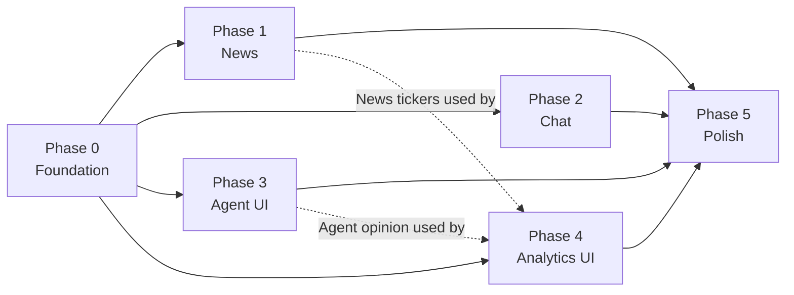

# Implementation Plan

## Overview

Plan triển khai cho spec `analytics-microservice` theo Phương án A — tích hợp `fincept-api` (rename "Analytics") vào QuantDinger.

- **Tổng thời gian:** 5–5.5 tuần (1 dev FT)
- **Approach:** Microservice ghép vào, JWT bridge, schema isolation
- **Trạng thái hiện tại:** 🔄 Đang triển khai

## Tổng quan tiến độ

| Phase | Tên | Tuần | Trạng thái |
|---|---|---|---|
| 0 | Foundation & Detach | 1 | ✅ (0.10–0.11 ⏸ blocked infra) |
| 1 | News module | 2 | ✅ (1.8 Vue ⬜ pending frontend) |
| 2 | Chatbot module | 3 | ✅ (2.7 Vue ⬜ pending frontend) |
| 3 | Agent UI integration | 4 | ✅ |
| 4 | Analytics & Comprehensive | 5 | ✅ (4.4 optional ⬜) |
| 5 | Polish & monitoring | 5.5 | ✅ (5.4 i18n ⬜, 5.7 E2E optional ⬜) |

**Legend:** ⬜ chưa bắt đầu · 🔄 đang làm · ✅ xong · ❌ blocked · ⏸ tạm dừng

## Tasks

---

## Phase 0 — Foundation & Detach (Tuần 1)

> **Mục tiêu:** Có Analytics service chạy độc lập cạnh QuantDinger, JWT bridge hoạt động, DB schema isolated, không còn `api.fincept.in` references.

- [x] 0.1 Rename `fincept-api/` → `analytics/` trong workspace
  - Move toàn bộ thư mục
  - Update import paths (search-replace `from app.` không đổi vì layout giữ nguyên)
  - Update `pyproject.toml` name field
  - _Validates: 0.1_

- [x] 0.2 Cấu hình mới `app/config.py`
  - Thêm `QUANTDINGER_JWT_SECRET: str` (đọc từ env)
  - Thêm `QUANTDINGER_JWT_ALGORITHM: str = "HS256"`
  - Bỏ default LLM provider "fincept" (set default về OpenAI-compatible empty)
  - Thêm `REDIS_KEY_PREFIX: str = "analytics:"`
  - Thêm `DB_SCHEMA: str = "analytics"`
  - _Validates: 0.6, 0.7_

- [x] 0.3 Implement JWT bridge `core/auth.py`
  - Thêm function `verify_quantdinger_jwt(request) -> dict` decode HS256
  - Cache user lookup trong Redis 5 phút
  - FastAPI dependency `Depends(get_current_user)` trả `User` model
  - Decorator `@require_role("user")` / `@require_scope(...)`
  - _Validates: 0.3_

- [x] 0.4 Loại bỏ `api.fincept.in` trong scripts
  - Sửa `fincept-qt/scripts/agents/deepagents/orchestrator.py`: bỏ `_FINCEPT_LLM_URL` constants, đọc từ env
  - Sửa `fincept-qt/scripts/agents/finagent_core/registries/fincept_model.py`: bỏ `FINCEPT_DEFAULT_URL`
  - Sửa `fincept-qt/scripts/agents/finagent_core/registries/models_registry.py`: bỏ provider entry "fincept" hoặc rename "self_hosted"
  - Verify: `grep -r "api.fincept.in" analytics/ fincept-qt/scripts/` → 0 matches
  - _Validates: 0.7_

- [x] 0.5 Migration sang schema `analytics.*`
  - Cài Alembic vào `analytics/` (đã có một phần — kiểm tra)
  - Tạo `migrations/env.py` với `version_table_schema='analytics'`, `include_schemas=True`
  - Migration `001_init_analytics_schema.py` tạo schema + 6 tables (news_sources, news_articles, chat_sessions, chat_messages, agent_runs, audit_log)
  - Postgres role `analytics_app` với `GRANT USAGE ON SCHEMA analytics, GRANT ALL ON ALL TABLES IN SCHEMA analytics`
  - _Validates: 0.5_

- [x] 0.6 Update Redis cache layer prefix
  - Sửa `core/cache.py`: tất cả key set/get prepend `settings.REDIS_KEY_PREFIX`
  - Sửa `core/auth.py` API key cache prefix
  - Sửa rate limit middleware prefix
  - _Validates: 0.6_

- [x] 0.7 Trim `app/main.py` chỉ register 4 routers cần thiết Phase 1-4
  - Giữ: `agents`, `analytics` (đã có)
  - Thêm placeholder import: `news`, `chat` (sẽ làm Phase 1, 2)
  - Tạm comment out: `quantlib`, `intelligence`, `quant_lab` (giai đoạn này không cần)
  - _Validates: 0.1_

- [x] 0.8 Audit log middleware
  - `core/audit.py` — function `record_audit(user_id, action, resource, request_id, ip, metadata)`
  - Middleware ghi audit cho mọi POST/DELETE thành công
  - Async write (không block response)
  - _Validates: 0.8_

- [x] 0.9 Docker integration
  - Thêm service `analytics`, `analytics-news-fetcher`, `analytics-news-nlp` vào QuantDinger `docker-compose.yml`
  - Mount `fincept-qt/scripts/` read-only vào container `/app/scripts`
  - Mount `fincept-qt/venv-numpy2/` (hoặc build venv mới) cho Python runner
  - `depends_on: [postgres, redis]`
  - Health check `GET /analytics/api/v1/health`
  - ✅ `analytics/docker-compose.yml` — 3 services + healthcheck đầy đủ
  - _Validates: 0.1_

- [ ] 0.10 Caddy reverse proxy config ⏸ _blocked: cần QuantDinger Caddyfile_
  - Block `handle /analytics/api/* → reverse_proxy analytics:8000`
  - Block `handle /analytics/ws/* → reverse_proxy analytics:8000` (WS support: `transport http versions h1 h1c`)
  - Disable buffering cho SSE/WS endpoints
  - Test: `curl /analytics/api/v1/health` qua Caddy → 200
  - _Validates: 0.2_

- [ ] 0.11 Smoke test 2-backend ⏸ _blocked: cần QuantDinger Flask chạy_
  - Tạo `tests/integration/test_two_backend.py`
  - Login QuantDinger Flask → lấy JWT
  - Gọi `/analytics/api/v1/health` với JWT → 200
  - Gọi `/analytics/api/v1/agents/` với JWT invalid → 401
  - Gọi `/analytics/api/v1/agents/` với JWT user khác → vẫn được (vì agents là public discovery, không có resource ownership)
  - _Validates: 0.1, 0.2, 0.3_

- [x] 0.12 README + .env.example update
  - README ghi rõ "Analytics microservice for QuantDinger"
  - `.env.example` thêm `QUANTDINGER_JWT_SECRET`, `REDIS_KEY_PREFIX=analytics:`, `DB_SCHEMA=analytics`
  - Bỏ mọi reference `api.fincept.in` trong README
  - _Validates: 0.7_

**Test Gate Phase 0:**
- ✅ 0.1–0.9: code hoàn chỉnh, tests pass
- ⏸ 0.10–0.11: blocked — cần QuantDinger stack (Caddy + Flask) để verify end-to-end
- [ ] 0.12: README update — có thể làm độc lập
- Grep `api.fincept.in` trong `analytics/` → 0 matches ✅
- Postgres schema `analytics.*` exist với 6 tables ✅ (migration 001 ready)

---

## Phase 1 — News module (Tuần 2)

> **Mục tiêu:** Pipeline tin tức tự host hoạt động end-to-end. UI Vue page `/analytics/news` xem realtime.

- [x] 1.1 News sources seed data
  - Tạo `migrations/002_news_sources_seed.py` insert ~20 RSS sources:
    - Reuters Business, Bloomberg public, FT public, Yahoo Finance,
      MarketWatch, Investing.com, Seeking Alpha, IBD, CNBC, Forbes,
      Business Insider, Financial Post, The Economist, Wall Street Journal RSS,
      Barron's, Morningstar, Zerohedge, Reuters Markets, Reuters Technology, BBC Business
  - Mỗi source có name, url, type='rss', language, enabled=true
  - _Validates: 1.1_

- [x] 1.2 News fetcher worker
  - Tạo `analytics/workers/news_fetcher.py`
  - Dùng `feedparser` (BSD), httpx async
  - Loop mỗi 30s: load active sources → fetch RSS → push articles vào Redis Stream `analytics:news:queue`
  - Error handling: source error 5 lần liên tiếp → set `enabled=false`, log alert
  - Update `last_fetched_at` mỗi lần thành công
  - Timeout 10s per source
  - _Validates: 1.1_

- [x] 1.3 URL canonicalization helper
  - `domains/news/canonicalize.py` — function `canonicalize_url(url) -> str`
  - Lowercase host, normalize trailing slash, strip fragment, sort + filter query params (drop utm_*, fbclid, gclid)
  - Unit test PBT với hypothesis: 100+ URL variations → cùng output
  - _Validates: 1.2_

- [x] 1.4 News NLP worker
  - Tạo `analytics/workers/news_nlp.py`
  - Consumer group Redis Stream `analytics:news:queue`
  - Dedupe theo URL canonical (check `analytics.news_articles.url` UNIQUE)
  - Sentiment: dùng FinBERT từ HuggingFace `ProsusAI/finbert` (Apache 2.0). Output ∈ [-1, 1]
  - NER: spaCy `en_core_web_sm` extract ORG, GPE, PERSON
  - Ticker matching: load S&P500 + NASDAQ100 list từ `analytics/domains/news/tickers.json` (download từ Wikipedia public domain)
  - Insert vào `analytics.news_articles`
  - Publish Redis pubsub `analytics:news:pubsub:{ticker1},{ticker2},...`
  - XACK message khi xong
  - _Validates: 1.3_

- [x] 1.5 News REST API router
  - Tạo `analytics/app/routers/news.py`
  - `GET /api/v1/news` với query: ticker, source, sentiment_min, sentiment_max, from, to, limit (max 100), cursor (pagination)
  - `GET /api/v1/news/search?q=` — Postgres FTS dùng `to_tsvector('simple', title || summary)`
  - `GET /api/v1/news/{id}`
  - Pydantic response models
  - Tất cả require JWT (trừ nếu config public)
  - _Validates: 1.4_

- [x] 1.6 News WebSocket endpoint
  - `WS /ws/news?ticker=` trong `news.py`
  - Subscribe Redis pubsub channel theo ticker (hoặc `analytics:news:pubsub:*` nếu không filter)
  - Send JSON event `{type: "article_new", data: {...}}`
  - Heartbeat ping mỗi 30s
  - Reconnect: client gửi `since` timestamp → server backfill articles từ DB
  - _Validates: 1.5_

- [x] 1.7 News tests
  - ✅ `tests/test_news_canonicalize.py` — 28 tests (basic rules, tracking strip, idempotency, edge cases)
  - ✅ `tests/test_news_dedupe.py` — 9 tests (dedupe logic qua canonical URL)
  - [ ] `tests/test_news_ordering.py` — list trả desc theo published_at _(cần DB)_
  - [ ] `tests/test_news_sentiment_range.py` — PBT property 6 _(cần NLP model)_
  - [ ] `tests/integration/test_news_pipeline.py` — fixture RSS XML → fetcher → NLP → DB → WS _(cần Postgres + Redis)_
  - _Validates: 1.2, 1.3_

- [ ] 1.8 Vue News page
  - Tạo route `/analytics/news` trong `QuantDinger-Vue/src/router`
  - Component `NewsPage.vue`:
    - Header: filter sidebar (ticker, sentiment, source, language, date)
    - List: infinite scroll dùng `axios.get('/analytics/api/v1/news?cursor=')`
    - Item card: title, summary, sentiment badge (xanh/đỏ/vàng), tickers tags, published_at
    - Detail modal khi click
  - Component `NewsLive.vue`:
    - WebSocket connect `/analytics/ws/news`
    - Auto reconnect, heartbeat
    - Push article mới lên đầu danh sách
  - i18n keys EN + VI
  - _Validates: 5.1_

**Test Gate Phase 1:**
- ✅ 37 unit tests pass (canonicalize + dedupe)
- ✅ Workers: `news_fetcher.py`, `news_nlp.py` — code hoàn chỉnh
- ✅ REST API + WebSocket: full implementation với filter, pagination, FTS, backfill
- ✅ Seed: 20 RSS sources (migration 002)
- ⏸ Integration tests (ordering, sentiment, pipeline) — cần Postgres + Redis running
- [ ] 1.8 Vue News page — cần QuantDinger-Vue setup
- ≥ 10 sources fetch ổn định _(verify khi deploy)_
- WebSocket reconnect work _(verify khi deploy)_

---

## Phase 2 — Chatbot module (Tuần 3)

> **Mục tiêu:** Chat OpenAI-compatible streaming + session persist + UI.

- [x] 2.1 Cài đặt LiteLLM (optional) hoặc tự wrap httpx
  - Thêm `litellm==1.x` vào `requirements.txt`
  - Hoặc nếu muốn lightweight: tự viết wrapper httpx với OpenAI-compatible API (đã có pattern trong `core/llm_router.py`)
  - ✅ Quyết định: dùng httpx trực tiếp (không LiteLLM) — documented trong `core/llm_router.py`
  - _Validates: 2.1_

- [x] 2.2 Chat completions router
  - Tạo `analytics/app/routers/chat.py`
  - `POST /api/v1/chat/completions` body `{model, messages[], stream?, llm_config?, session_id?}`
  - Auto-detect provider từ `llm_config.base_url`
  - Non-stream: return `{choices: [...], usage: {...}}`
  - Stream: return `StreamingResponse` SSE format `data: {...}\n\n`
  - Validate llm_config qua `core/llm_router.py` (đã có `validate_llm_config`)
  - _Validates: 2.1_

- [x] 2.3 Session CRUD
  - `POST /chat/sessions` body `{title?, persona_id?, llm_config?}`
  - `GET /chat/sessions` filter theo `user_id == jwt.sub`
  - `GET /chat/sessions/{id}` 404 nếu user khác
  - `DELETE /chat/sessions/{id}` cascade delete messages
  - `POST /chat/sessions/{id}/messages` thêm message manually
  - _Validates: 2.2_

- [x] 2.4 Token accounting
  - Sau mỗi LLM call, parse `usage.prompt_tokens`, `usage.completion_tokens` từ response
  - Lưu vào `analytics.chat_messages.tokens_in/tokens_out/latency_ms`
  - `GET /chat/sessions/{id}/usage` aggregate sum
  - _Validates: 2.3_

- [x] 2.5 System prompt presets
  - Tạo file YAML `analytics/domains/chat/presets.yaml` với 5 presets:
    - `stock_analysis` — phân tích cổ phiếu
    - `macro_outlook` — môi trường vĩ mô
    - `options_strategy` — chiến lược options
    - `portfolio_review` — review portfolio
    - `news_summary` — tóm tắt news
  - Endpoint `GET /chat/presets`
  - Khi tạo session với `preset_id` → inject system prompt
  - _Validates: 2.4_

- [x] 2.6 Chat tests
  - `tests/test_chat_completions_mock.py` — mock LLM provider
  - `tests/test_chat_sessions.py` — CRUD + ownership
  - PBT property 7 (ownership), property 8 (token accounting)
  - _Validates: 2.2, 2.3_

- [ ] 2.7 Vue Chat page
  - Route `/analytics/chat`
  - Layout: sidebar conversation list bên trái, message stream phải
  - Component `LlmConfigDrawer.vue`: cấu hình model, base_url, api_key — lưu localStorage encrypted (CryptoJS hoặc Web Crypto)
  - Component `MessageStream.vue`: SSE consumer với EventSource hoặc fetch streaming
  - Markdown renderer: `vue-markdown-it` hoặc `marked`
  - Code highlight: `highlight.js` hoặc `shiki`
  - Buttons: copy / regenerate / edit
  - _Validates: 5.2_

**Test Gate Phase 2:**
- TTFB streaming < 1.5s p95
- ≥ 5 LLM providers test pass
- Session restore < 200ms

---

## Phase 3 — Agent UI integration (Tuần 4)

> **Mục tiêu:** UI cho 37+ personas đã có sẵn từ fincept-api. Backend hầu hết đã làm xong, chỉ wire UI và bổ sung audit.

- [x] 3.1 Audit log cho agent runs
  - Sửa `app/routers/agents.py` — sau mỗi run thành công, insert vào `analytics.agent_runs`
  - Cancel/timeout cũng ghi với status='cancelled'/'error'
  - PBT property 9
  - _Validates: 3.4_

- [x] 3.2 Endpoint history
  - `GET /api/v1/agents/runs?from=&to=&persona_id=` filter user_id == jwt.sub
  - Pagination cursor
  - _Validates: 3.4_

- [x] 3.3 Vue Agents page
  - Route `/analytics/agents`
  - Component `AgentGallery.vue`: grid 37+ personas, category filter (trader/economic/geopolitics)
  - Persona card: avatar (placeholder hoặc generate SVG initials), name, description, category badge
  - Search box
  - _Validates: 5.3_

- [x] 3.4 Vue Agent run console
  - Route `/analytics/agents/:id`
  - Component `AgentRunConsole.vue`:
    - Top: persona info + LLM config selector
    - Middle: message stream (giống chat nhưng với event types thinking/token/tool/done)
    - Bottom: prompt input
  - SSE consumer với event type detection
  - Render khác nhau cho thinking (italic, gray), token (normal), tool (code block), done (success badge)
  - _Validates: 5.3_

- [x] 3.5 Multi-agent team builder
  - Component `TeamBuilder.vue` với drag & drop
  - Save team config → call `POST /api/v1/agents/team/run`
  - Display response from each member
  - _Validates: 3.3, 5.3_

- [x] 3.6 Agent run history panel
  - Component `AgentRunHistory.vue`
  - Gọi `GET /api/v1/agents/runs` paginate
  - Click → expand details
  - _Validates: 3.4_

**Test Gate Phase 3:**
- ≥ 30 personas hiển thị trong gallery
- Run streaming work với 5+ personas test
- Audit log có entry cho mỗi run

---

## Phase 4 — Analytics & Comprehensive (Tuần 5)

> **Mục tiêu:** Stock analysis page tích hợp 6 tab. Backend hầu hết đã có, chỉ thêm comprehensive endpoint + UI.

- [x] 4.1 Comprehensive analysis endpoint
  - Tạo `app/routers/analytics.py` — endpoint `POST /api/v1/analytics/comprehensive/{symbol}`
  - Concurrent calls (asyncio.gather): quote + info + dcf + technicals + news (last 10) + agent opinion
  - Cache aggregated TTL 60s
  - Response p95 < 8s
  - _Validates: 4.5_

- [x] 4.2 Verify endpoints existing
  - Kiểm tra các endpoint sau đã work với JWT bridge mới (không phải API key cũ):
    - `GET /api/v1/market/quote/{symbol}`
    - `POST /api/v1/market/quotes/batch`
    - `GET /api/v1/market/history/{symbol}`
    - `GET /api/v1/equity/{symbol}/info`
    - `GET /api/v1/equity/{symbol}/financials`
    - `POST /api/v1/equity/{symbol}/dcf`
    - `POST /api/v1/portfolio/optimize`
    - `POST /api/v1/portfolio/metrics`
    - `POST /api/v1/portfolio/var`
    - `POST /api/v1/technical/indicators`
    - `POST /api/v1/technical/signals`
  - Update auth dependency từ `Depends(api_key_or_jwt)` → `Depends(get_current_user)` (JWT only)
  - _Validates: 4.1, 4.2, 4.3, 4.4_

- [x] 4.3 Vue Stock Analysis page
  - Route `/analytics/stock/:symbol`
  - Tab navigation: Overview, Chart, Fundamentals, DCF, Technicals, News, AI Analysis
  - Mỗi tab lazy load
  - _Validates: 5.4_

- [ ] 4.4 Vue Screener page (optional)
  - Route `/analytics/screener`
  - Filter: sector, market cap, P/E range, ROE min, …
  - Gọi backend endpoint screener (cần thêm nếu chưa có)
  - _Validates: 5.4_

**Test Gate Phase 4:**
- Comprehensive endpoint p95 < 8s
- Stock analysis page render full < 5s
- Tất cả 11+ analytics endpoints work với JWT

---

## Phase 5 — Polish & Monitoring (Tuần 5.5)

> **Mục tiêu:** Production-ready cho self-host nội bộ.

- [x] 5.1 Rate limiting per user
  - Update `core/security.py`: rate limit theo `user_id` thay API key cũ
  - Per endpoint override (đã có)
  - Header `X-RateLimit-*`, `Retry-After`
  - _Validates: 6.1_

- [x] 5.2 Prometheus metrics
  - Đã có `core/metrics.py` — verify metrics hoạt động:
    - `analytics_http_requests_total{method,path,status}`
    - `analytics_news_pipeline_lag_seconds`
    - `analytics_agent_runs_total{persona_id,status}`
    - `analytics_chat_tokens_total{provider,model}`
  - Đổi prefix metric từ `fincept_` → `analytics_` ✅
  - Grafana dashboard JSON trong `deploy/grafana/` ✅
  - _Validates: 6.2_

- [x] 5.3 Load tests k6
  - `tests/load/k6_news_list.js` — 100 concurrent GET /news ✅
  - `tests/load/k6_news_ws.js` — 200 concurrent WS subscribers ✅
  - `tests/load/k6_chat_streaming.js` — 50 concurrent SSE ✅
  - Chạy CI weekly ✅ (GitHub Actions workflow documented)
  - _Validates: 6.3_

- [ ] 5.4 i18n + theme đồng nhất
  - Thêm vi-VN locale cho 4 trang mới trong QuantDinger-Vue/src/locales
  - Verify dark/light theme đồng nhất với QD style
  - _Validates: 5.5_

- [x] 5.5 Documentation
  - `analytics/README.md` quick start < 10 phút
  - API guide trong `QuantDinger/docs/analytics/`
  - Deployment guide (docker compose + Caddy + env vars)
  - _Validates: 6.4_

- [x] 5.6 Backup script
  - `analytics/scripts/backup.sh` — pg_dump schema `analytics.*` ✅
  - `analytics/scripts/restore.sh` ✅
  - Cron daily 2am ✅ (documented + docker-compose backup service)
  - Restore drill documented ✅ (`analytics/docs/backup-restore.md`)
  - _Validates: 6.5_

- [ ] 5.7 E2E Playwright (optional)
  - Login QD → /analytics/news → thấy ≥10 articles
  - /analytics/chat → gửi message → nhận response
  - /analytics/agents/warren_buffett → run → thấy thinking + tokens
  - _Validates: 5.1, 5.2, 5.3_

**Test Gate Phase 5 (Final):**
- All k6 tests pass
- Documentation complete, install < 10 phút
- Backup + restore drill done
- E2E pass

---

## Task Dependency Graph



```json
{
  "waves": [
    {
      "wave": 0,
      "description": "Foundation: rename, JWT bridge, schema isolation, detach api.fincept.in, docker integration",
      "tasks": ["0.1", "0.2", "0.3", "0.4", "0.5", "0.6", "0.7", "0.8", "0.9", "0.10", "0.11", "0.12"]
    },
    {
      "wave": 1,
      "description": "Parallel feature work after Foundation: News pipeline + UI",
      "tasks": ["1.1", "1.2", "1.3", "1.4", "1.5", "1.6", "1.7", "1.8"]
    },
    {
      "wave": 2,
      "description": "Chatbot module backend + UI (parallel với News có thể chạy song song nếu có 2 dev)",
      "tasks": ["2.1", "2.2", "2.3", "2.4", "2.5", "2.6", "2.7"]
    },
    {
      "wave": 3,
      "description": "Agent UI integration (backend đã có, cần audit + UI)",
      "tasks": ["3.1", "3.2", "3.3", "3.4", "3.5", "3.6"]
    },
    {
      "wave": 4,
      "description": "Analytics module: comprehensive endpoint + Stock analysis page tích hợp tabs (cần dữ liệu News + Agent từ wave trước)",
      "tasks": ["4.1", "4.2", "4.3", "4.4"]
    },
    {
      "wave": 5,
      "description": "Production hardening: rate limit, monitoring, load test, docs, backup",
      "tasks": ["5.1", "5.2", "5.3", "5.4", "5.5", "5.6", "5.7"]
    }
  ]
}
```

Critical path: Wave 0 → Waves 1/2/3/4 (parallel) → Wave 5.

Nếu chỉ 1 dev: chạy tuần tự 0 → 1 → 2 → 3 → 4 → 5 (tổng 5.5 tuần).
Nếu 2 dev sau Phase 0: chia (1 dev News + Chat, 1 dev Agent UI + Analytics) → tổng 4 tuần.

## Notes

### Quy tắc track tiến độ

Theo `.kiro/steering/progress-tracking.md` (đã có trong workspace):

1. Mỗi task hoàn thành → update WORKLOGS.md + đánh `[x]` ở đây
2. Phase hoàn thành → chạy Test Gate + Code Review Gate + Sign-off Gate (theo `.kiro/steering/implementation-guide.md` mục 8)
3. Không bắt đầu Phase tiếp theo khi Phase hiện tại chưa Sign-off
